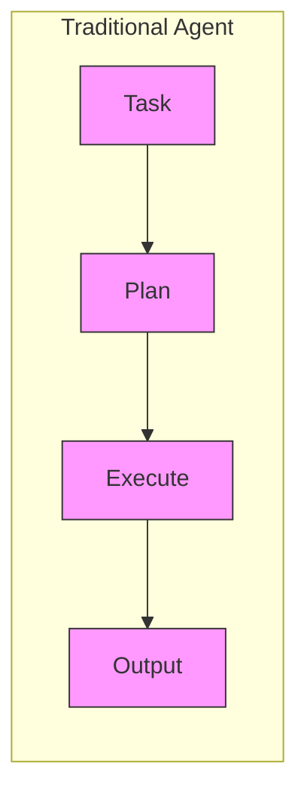
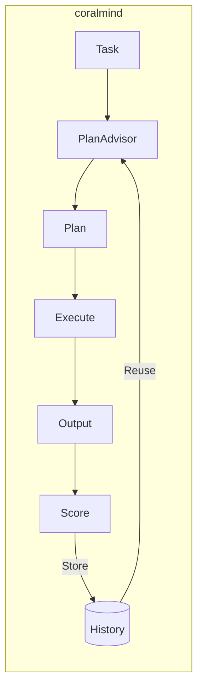
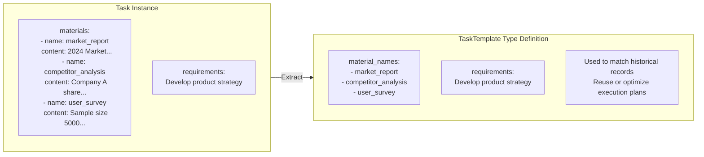
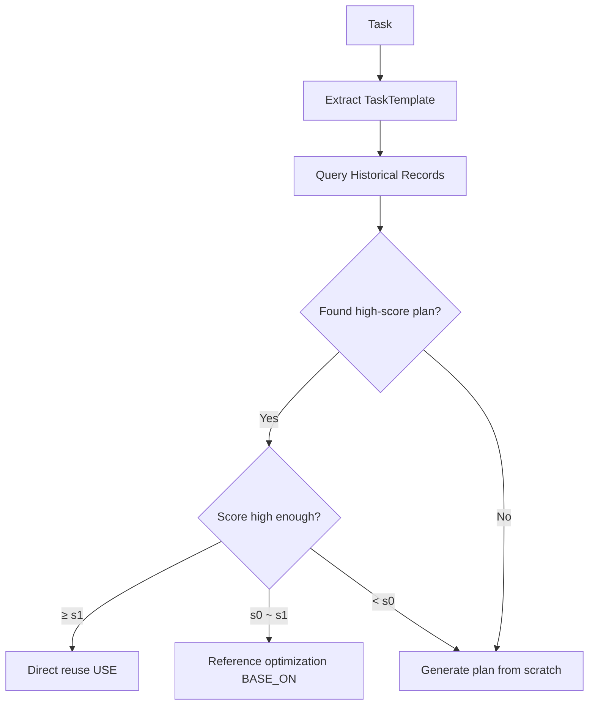
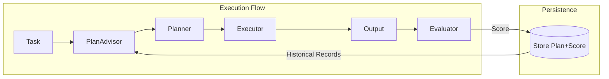
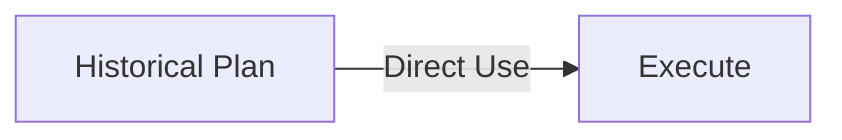
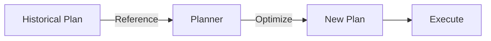
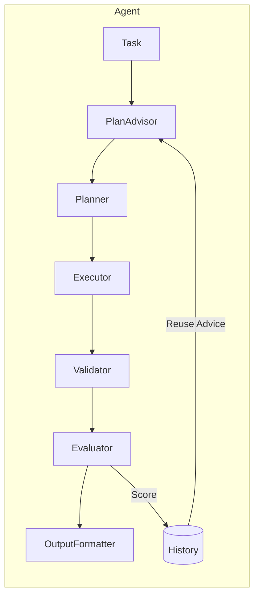

# coralmind

<p align="center">
  <strong>A Self-Evolving AI Agent Framework with Self-Planning Capabilities</strong>
</p>

<p align="center">
  <em>The more it executes, the smarter it gets</em>
</p>

<p align="center">
  <a href="https://pypi.org/project/coralmind/">
    
  </a>
  <a href="https://github.com/KoanJan/coralmind/blob/main/LICENSE">
    
  </a>
  <a href="https://www.python.org/">
    
  </a>
  <a href="https://github.com/KoanJan/coralmind/actions">
    
  </a>
  <a href="https://codecov.io/gh/KoanJan/coralmind">
    
  </a>
</p>

<p align="center">
  <a href="README.md">English</a> | <a href="README_CN.md">简体中文</a>
</p>

---

## Why coralmind?

Most Agent frameworks on the market are stateless—each execution is a "first time", unable to learn from historical experience.

**coralmind is different**:





> 💡 **The more it executes, the better the plans, the faster the response**

**Core Differences**:

| Feature | Traditional Agent | coralmind |
|---------|------------------|-----------|
| Task Planning | Generate from scratch each time | Reuse/optimize historical plans |
| Execution Experience | Not retained | Persistently stored |
| Quality Assessment | None | LLM auto-scoring |
| Self-Evolution | ❌ | ✅ |

**Use Cases**:
- Repetitive tasks (e.g., periodic report generation, code review)
- Structured workflows (e.g., data analysis pipelines)
- Business scenarios requiring continuous optimization

## Features

- **Self-Evolution** - Learns from historical executions, continuously improving plan quality
- **Intelligent Planning** - Automatically decomposes complex tasks into multi-node execution plans
- **Result Validation** - Dual guarantee with rule-based and semantic validation
- **Closed-Loop Feedback** - Execution result scoring drives plan optimization
- **Persistent Storage** - Task templates and execution plans automatically saved for cross-session reuse
- **JSON Schema Output** - Structured output with comprehensive JSON Schema support (enum, const, anyOf, oneOf, allOf, constraints, etc.)

## Installation

```bash
pip install coralmind
```

### Development Installation

```bash
git clone https://github.com/KoanJan/coralmind.git
cd coralmind
python -m venv venv
source venv/bin/activate
pip install -e ".[dev]"
```

## Quick Start

```python
from coralmind import Agent, Task, Material, LLMConfig

llm = LLMConfig(
    model_id="gpt-4",
    base_url="https://api.openai.com/v1",
    api_key="your-api-key",
)

agent = Agent(default_llm=llm)

task = Task(
    materials=[Material(name="article", content="Long text content...")],
    requirements="Summarize the input article in no more than 100 words, including core viewpoints"
)

result = agent.run(task)
print(result)
```

**Expected Output:**

```
Status: success
Summary: This article discusses the development history and future trends of artificial intelligence...
```

## Core Concepts

### Material

Material is the input data unit of a task, its `name` field has a **semantic role**:

```python
class Material:
    name: str      # Semantic role identifier, determines the material's position in the execution plan
    content: str   # Specific content, different for each task instance
```

`name` is not just an identifier, but a clue for Planner to understand the material's purpose:

```python
# ✅ Good naming: Clear semantics, Planner can design reasonable processing nodes
Material(name="market_report", content="...")      # → Analyze market node
Material(name="competitor_analysis", content="...") # → Analyze competitors node
Material(name="user_survey", content="...")        # → Analyze users node

# ❌ Bad naming: No semantics, Planner cannot distinguish roles
Material(name="input1", content="...")
Material(name="data", content="...")
```

### Task

Task is a **task instance** submitted by the user, containing specific data and execution requirements:

```python
class Task:
    materials: List[Material]  # Input data (different each time)
    requirements: str          # Task requirements (abstract description, no specific content)
```

### TaskTemplate

TaskTemplate is a **task type definition** extracted from Task:

```python
class TaskTemplate:
    material_names: List[str]  # Material role list (defines what types of inputs are needed)
    requirements: str          # Task requirements (same as Task)
```

TaskTemplate defines "the structure of this type of task":
- What roles of materials are needed
- What goals to achieve

### Relationship Between Task and TaskTemplate



**Key Insight**: TaskTemplate's `material_names` determines the **structural complexity** of the task:

| material_names | Task Complexity | Typical Plan |
|----------------|-----------------|--------------|
| `["article"]` | Simple | Single node: Direct processing |
| `["code", "requirements"]` | Medium | Dual nodes: Understand→Generate |
| `["market_report", "competitor_analysis", "user_survey"]` | Complex | Multi-node: Parallel analysis→Comprehensive decision |

### Reuse Mechanism

When a user submits a Task, the system's workflow:



**Essence of Reuse**: Not reusing specific content, but reusing "methodology for handling similar problems".

### ⚠️ Key Constraints

#### 1. requirements Must Be Abstract

`requirements` describes "what to do", should not contain specific content:

```python
# ✅ Correct: Abstract description
requirements = "Summarize the input article in no more than 100 words"

# ❌ Wrong: Contains specific content
requirements = "Summarize this article about artificial intelligence"
#                    ^^^^^^^^^^^^^^^^^ This part breaks reusability
```

#### 2. Material.name Must Have Semantics

The name is the basis for Planner to understand the material's role:

```python
# ✅ Correct: Semantic naming
Material(name="source_code", content="...")
Material(name="test_cases", content="...")

# ❌ Wrong: Meaningless naming
Material(name="file1", content="...")
Material(name="text", content="...")
```

#### 3. Only Same Template Can Be Reused

The following two Tasks **cannot be reused** because Templates are different:

```python
# Task A
Task(
    materials=[Material(name="article", content="...")],
    requirements="Generate summary"
)
# Template: material_names=["article"], requirements="Generate summary"

# Task B  
Task(
    materials=[Material(name="report", content="...")],  # Different name
    requirements="Generate summary"
)
# Template: material_names=["report"], requirements="Generate summary"
#           ^^^^^^^^^^^^^^^^ Different from Task A, cannot reuse
```

**Best Practice**: Use consistent naming conventions for the same type of tasks.

### Closed-Loop Learning Mechanism

The framework achieves continuous optimization through **Evaluator** and **PlanAdvisor**:



#### Evaluator

After task execution, Evaluator scores the result (0-10):

```python
# Scoring dimensions
- Whether requirements are met
- Output quality and completeness
- Whether there is redundant or irrelevant content
```

The score is stored together with the Plan, forming historical records.

#### PlanAdvisor

When encountering the same TaskTemplate next time, PlanAdvisor queries historical records and makes decisions:

```python
class ThresholdStrategy:
    s0: float = 8.5   # Optimization threshold
    s1: float = 9.5   # Direct reuse threshold
    c: int = 3        # Minimum historical records
```

Decision logic:

| Historical Records | Highest Avg Score | Decision |
|-------------------|-------------------|----------|
| < c | - | Generate new plan from scratch |
| ≥ c | ≥ s1 | Direct reuse (USE) |
| ≥ c | s0 ~ s1 | Reference optimization (BASE_ON) |
| ≥ c | < s0 | Generate new plan from scratch |

#### Two Reuse Modes

**USE (Direct Reuse)**: Historical plan performs excellently, use directly



**BASE_ON (Reference Optimization)**: Historical plan performs well, use as reference



#### Continuous Optimization Effect

```
1st execution: No history → Generate from scratch → Score 7.0 → Store
2nd execution: No history → Generate from scratch → Score 6.5 → Store
3rd execution: No history → Generate from scratch → Score 8.0 → Store
4th execution: Has history (avg 7.2) → BASE_ON optimize → Score 8.5 → Update
5th execution: Has history (avg 7.6) → BASE_ON optimize → Score 9.0 → Update
6th execution: Has history (avg 8.2) → USE direct reuse → Score 9.0 → Update
...
```

**Core Value**: The more tasks executed, the higher the plan quality, the faster the response.

## Configuration

### Logging Configuration

```python
import logging

coralmind_logger = logging.getLogger('coralmind')
coralmind_logger.setLevel(logging.DEBUG)
handler = logging.StreamHandler()
handler.setFormatter(logging.Formatter(
    '%(asctime)s - %(name)s - %(levelname)s - %(message)s'
))
coralmind_logger.addHandler(handler)
```

### Database Path

```python
import coralmind

coralmind.set_db_path("/path/to/your/coralmind.db")
```

### Layered LLM Configuration

```python
agent = Agent(
    default_llm=default_llm,
    planner_llm=planning_llm,      # Use stronger model for planning
    executor_llm=execution_llm,    # Use faster model for execution
    validator_llm=validation_llm,  # Use specialized model for validation
)
```

### Custom Strategy

```python
from coralmind import ThresholdStrategy

strategy = ThresholdStrategy(s0=8.0, s1=9.0, c=5)
agent = Agent(default_llm=llm, advising_strategy=strategy)
```

### Retry Count

```python
agent = Agent(default_llm=llm, max_retry_times_per_node=5)
```

## Architecture



## API Documentation

For detailed API documentation, see [API Reference](docs/README.md).

## Examples

See [examples/](examples/) directory for complete examples:

- [Basic: Text Summarization](examples/01_basic_summary.py)
- [Advanced: Multi-Material Analysis](examples/02_multi_material_analysis.py)
- [Expert: Custom Strategy](examples/03_custom_strategy.py)

## Running Tests

```bash
pip install -e ".[dev]"
pytest
```

## Contributing

Contributions are welcome! See [Contributing Guide](CONTRIBUTING.md).

## Changelog

See [CHANGELOG.md](CHANGELOG.md) for version history and updates.

## License

[MIT License](LICENSE)
