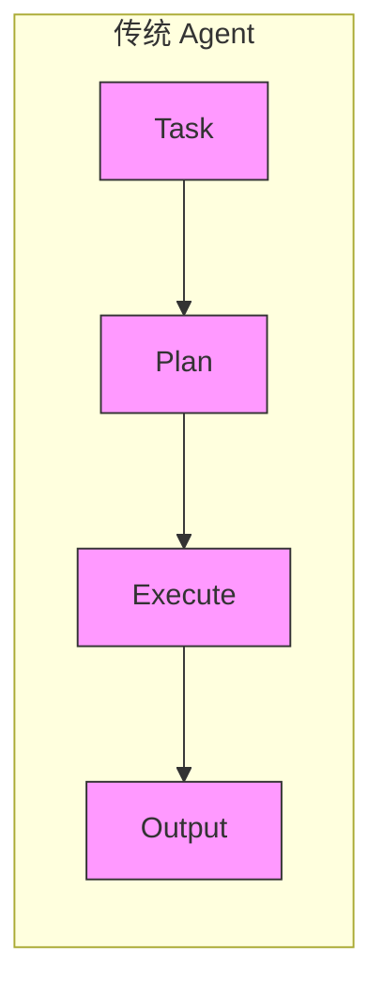
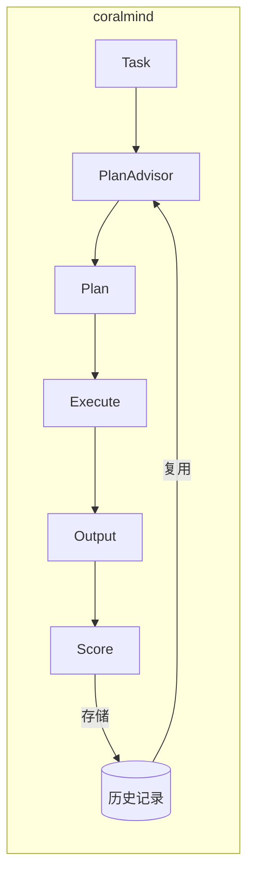
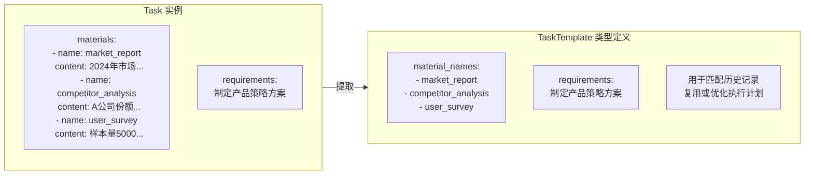
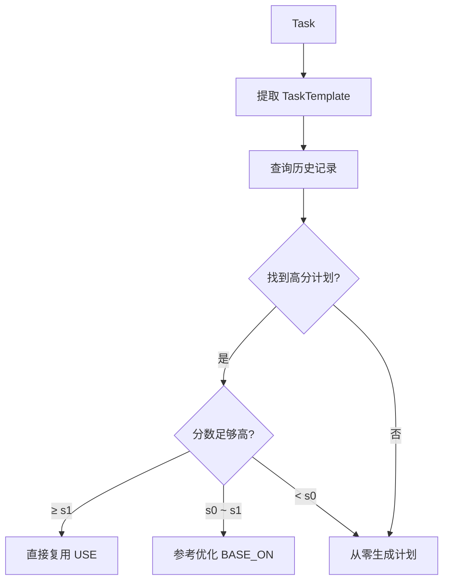
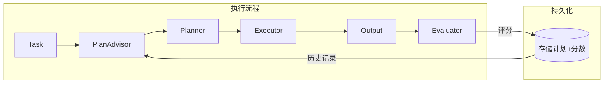
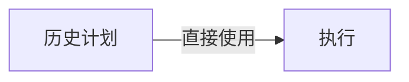
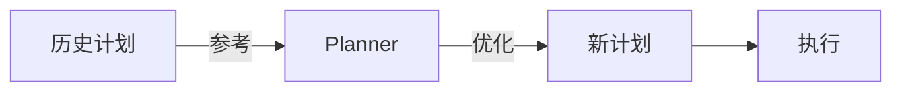
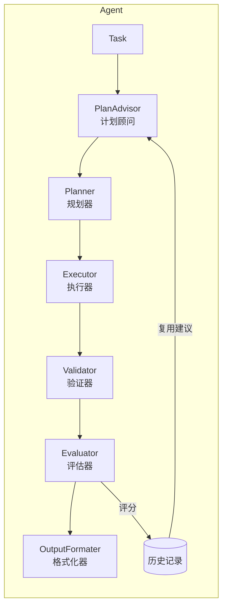

# coralmind

<p align="center">
  <strong>具备自我进化能力的自规划 AI Agent 框架</strong>
</p>

<p align="center">
  <em>执行越多，越聪明</em>
</p>

<p align="center">
  <a href="https://pypi.org/project/coralmind/">
    
  </a>
  <a href="https://github.com/KoanJan/coralmind/blob/main/LICENSE">
    
  </a>
  <a href="https://www.python.org/">
    
  </a>
  <a href="https://github.com/KoanJan/coralmind/actions">
    
  </a>
  <a href="https://codecov.io/gh/KoanJan/coralmind">
    
  </a>
</p>

<p align="center">
  <a href="README.md">English</a> | <a href="README_CN.md">简体中文</a>
</p>

---

## 为什么选择 coralmind？

市面上的 Agent 框架大多是无状态的——每次执行都是"第一次"，无法从历史经验中学习。

**coralmind 不同**：





> 💡 **执行越多，计划越优，响应越快**

**核心差异**：

| 特性 | 传统 Agent | coralmind |
|------|-----------|-----------|
| 任务规划 | 每次从零生成 | 复用/优化历史计划 |
| 执行经验 | 不保留 | 持久化存储 |
| 质量评估 | 无 | LLM 自动评分 |
| 自我进化 | ❌ | ✅ |

**适用场景**：
- 重复性任务（如定期报告生成、代码审查）
- 结构化流程（如数据分析流水线）
- 需要持续优化的业务场景

## 特性

- **自我进化** - 从历史执行中学习，计划质量持续提升
- **智能规划** - 自动分解复杂任务，生成多节点执行计划
- **结果验证** - 规则校验 + 语义校验双重保障
- **闭环反馈** - 执行结果评分，驱动计划优化
- **持久存储** - 任务模板与执行计划自动保存，支持跨会话复用

## 安装

```bash
pip install coralmind
```

### 开发安装

```bash
git clone https://github.com/KoanJan/coralmind.git
cd coralmind
python -m venv venv
source venv/bin/activate
pip install -e ".[dev]"
```

## 快速开始

```python
from coralmind import Agent, Task, Material, LLMConfig

llm = LLMConfig(
    model_id="gpt-4",
    base_url="https://api.openai.com/v1",
    api_key="your-api-key",
)

agent = Agent(default_llm=llm)

task = Task(
    materials=[Material(name="article", content="长文本内容...")],
    requirements="对输入文章进行摘要，不超过100字，包含核心观点"
)

result = agent.run(task)
print(result)
```

**预期输出：**

```
状态: success
摘要: 本文讨论了人工智能的发展历程和未来趋势...
```

## 核心概念

### Material（物料）

物料是任务的输入数据单元，其 `name` 字段具有**语义角色**：

```python
class Material:
    name: str      # 语义角色标识，决定物料在执行计划中的定位
    content: str   # 具体内容，每次任务实例不同
```

`name` 不仅是标识符，更是 Planner 理解物料用途的线索：

```python
# ✅ 好的命名：语义明确，Planner 能据此设计合理的处理节点
Material(name="market_report", content="...")      # → 分析市场节点
Material(name="competitor_analysis", content="...") # → 分析竞品节点
Material(name="user_survey", content="...")        # → 分析用户节点

# ❌ 坏的命名：无语义，Planner 无法区分角色
Material(name="input1", content="...")
Material(name="data", content="...")
```

### Task（任务）

Task 是用户提交的**任务实例**，包含具体数据和执行要求：

```python
class Task:
    materials: List[Material]  # 输入数据（每次不同）
    requirements: str          # 任务要求（抽象描述，不含具体内容）
```

### TaskTemplate（任务模板）

TaskTemplate 是从 Task 中提取的**任务类型定义**：

```python
class TaskTemplate:
    material_names: List[str]  # 物料角色列表（定义需要什么类型的输入）
    requirements: str          # 任务要求（与 Task 相同）
```

TaskTemplate 定义了"这类任务的结构"：
- 需要哪些角色的物料
- 要完成什么目标

### Task 与 TaskTemplate 的关系



**关键洞察**：TaskTemplate 的 `material_names` 决定了任务的**结构复杂度**：

| material_names | 任务复杂度 | 典型计划 |
|----------------|-----------|---------|
| `["article"]` | 简单 | 单节点：直接处理 |
| `["code", "requirements"]` | 中等 | 双节点：理解→生成 |
| `["market_report", "competitor_analysis", "user_survey"]` | 复杂 | 多节点：并行分析→综合决策 |

### 复用机制

当用户提交 Task 时，系统的工作流程：



**复用的本质**：不是复用具体内容，而是复用"处理同类问题的方法论"。

### ⚠️ 关键约束

#### 1. requirements 必须抽象

`requirements` 描述"要做什么"，不应包含具体内容：

```python
# ✅ 正确：抽象描述
requirements = "对输入文章进行摘要，不超过100字"

# ❌ 错误：包含具体内容
requirements = "对这篇关于人工智能的文章进行摘要"
#                    ^^^^^^^^^^^^^^^^ 这部分破坏了复用性
```

#### 2. Material.name 必须有语义

名称是 Planner 理解物料角色的依据：

```python
# ✅ 正确：语义化命名
Material(name="source_code", content="...")
Material(name="test_cases", content="...")

# ❌ 错误：无意义命名
Material(name="file1", content="...")
Material(name="text", content="...")
```

#### 3. 相同 Template 才能复用

以下两个 Task **无法复用**，因为 Template 不同：

```python
# Task A
Task(
    materials=[Material(name="article", content="...")],
    requirements="生成摘要"
)
# Template: material_names=["article"], requirements="生成摘要"

# Task B  
Task(
    materials=[Material(name="report", content="...")],  # name 不同
    requirements="生成摘要"
)
# Template: material_names=["report"], requirements="生成摘要"
#           ^^^^^^^^^^^^^^^^ 与 Task A 不同，无法复用
```

**最佳实践**：对于相同类型的任务，使用一致的命名规范。

### 闭环学习机制

框架通过 **Evaluator** 和 **PlanAdvisor** 实现持续优化：



#### Evaluator（评估者）

任务执行完成后，Evaluator 对结果进行评分（0-10分）：

```python
# 评分维度
- 是否满足 requirements
- 输出质量和完整性
- 是否有冗余或无关内容
```

评分结果与 Plan 一起持久化存储，形成历史记录。

#### PlanAdvisor（计划顾问）

下次遇到相同 TaskTemplate 时，PlanAdvisor 查询历史记录并决策：

```python
class ThresholdStrategy:
    s0: float = 8.5   # 优化阈值
    s1: float = 9.5   # 直接复用阈值
    c: int = 3        # 最小历史记录数
```

决策逻辑：

| 历史记录数 | 最高平均分 | 决策 |
|-----------|-----------|------|
| < c | - | 从零生成新计划 |
| ≥ c | ≥ s1 | 直接复用（USE） |
| ≥ c | s0 ~ s1 | 参考优化（BASE_ON） |
| ≥ c | < s0 | 从零生成新计划 |

#### 两种复用模式

**USE（直接复用）**：历史计划表现优异，直接使用



**BASE_ON（参考优化）**：历史计划表现良好，作为参考



#### 持续优化效果

```
第1次执行: 无历史 → 从零生成 → 评分 7.0 → 存储
第2次执行: 无历史 → 从零生成 → 评分 6.5 → 存储
第3次执行: 无历史 → 从零生成 → 评分 8.0 → 存储
第4次执行: 有历史(平均7.2) → BASE_ON优化 → 评分 8.5 → 更新
第5次执行: 有历史(平均7.6) → BASE_ON优化 → 评分 9.0 → 更新
第6次执行: 有历史(平均8.2) → USE直接复用 → 评分 9.0 → 更新
...
```

**核心价值**：任务执行越多，计划质量越高，响应速度越快。

## 配置

### 日志配置

```python
import logging

coralmind_logger = logging.getLogger('coralmind')
coralmind_logger.setLevel(logging.DEBUG)
handler = logging.StreamHandler()
handler.setFormatter(logging.Formatter(
    '%(asctime)s - %(name)s - %(levelname)s - %(message)s'
))
coralmind_logger.addHandler(handler)
```

### 数据库路径

```python
import coralmind

coralmind.set_db_path("/path/to/your/coralmind.db")
```

### 分层 LLM 配置

```python
agent = Agent(
    default_llm=default_llm,
    planner_llm=planning_llm,      # 规划环节使用更强的模型
    executor_llm=execution_llm,    # 执行环节使用更快的模型
    validator_llm=validation_llm,  # 验证环节使用专门的模型
)
```

### 自定义策略

```python
from coralmind import ThresholdStrategy

strategy = ThresholdStrategy(s0=8.0, s1=9.0, c=5)
agent = Agent(default_llm=llm, advising_strategy=strategy)
```

### 重试次数

```python
agent = Agent(default_llm=llm, max_retry_times_per_node=5)
```

## 架构



## API 文档

详细 API 文档请参考 [API Reference](docs/README.md)。

## 示例

查看 [examples/](examples/) 目录获取完整示例：

- [基础示例：文本摘要](examples/01_basic_summary.py)
- [进阶示例：多物料分析](examples/02_multi_material_analysis.py)
- [高级示例：自定义策略](examples/03_custom_strategy.py)

## 运行测试

```bash
pip install -e ".[dev]"
pytest
```

## 贡献

欢迎贡献代码！请查看 [Contributing Guide](CONTRIBUTING.md)。

## 许可证

[MIT License](LICENSE)
